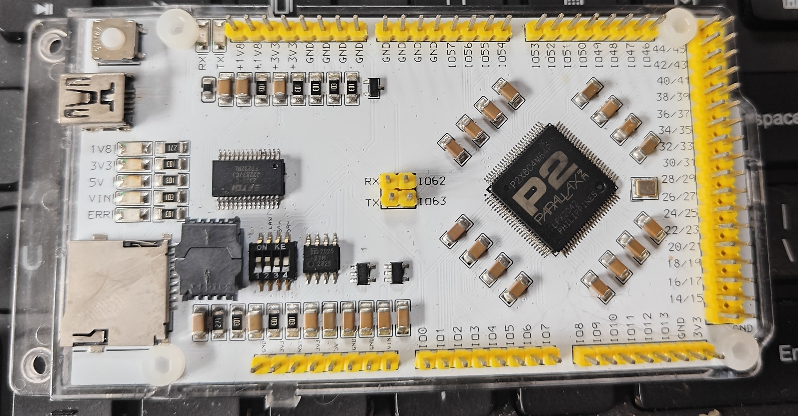
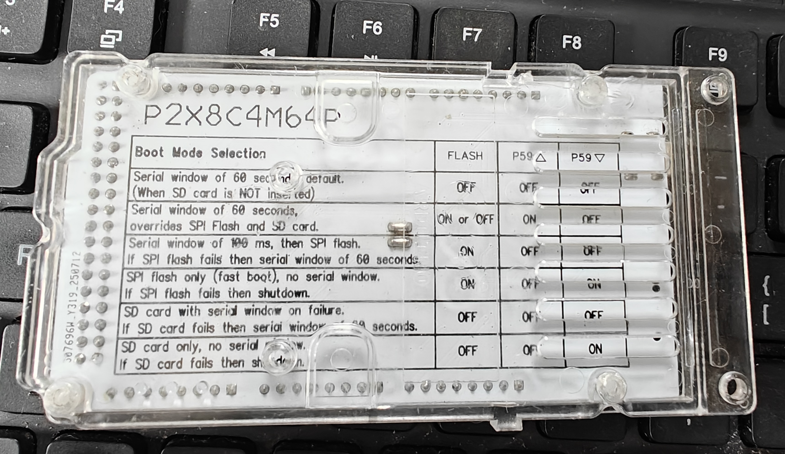

# P2DUINO-An Arduino Shape P2X8C4M64P Develop Board
 <!-- 添加板子图片 -->
## What is P2X8C4M64P
The Propeller P2X8C4M64P (P2) is a multicore microcontroller with the performance of an MPU, excelling at real-time analog and digital applications. Designed to help engineers achieve the fastest time to market, the P2’s highly flexible, deterministic hardware and development environment are free from the complication, expense and lead time associated with traditional FPGA-type development cycles.
## Key features
- **Arduino shape like** Compatible with Arduino expansion boards
- **Pins** 58 Smart pins
- **8 cores** High performance
- **SD** SD card support
- **SPI Flash** Supports switching between spiflash and SD for booting.
- **Easy to produce** Single-sided surface mount,use 1206 resistors and capacitors
- **Easy to use** This development board has pin markings, short-circuit protection, power indicator lights, and a power failure indicator light
- **Back label** The instruction manual is located on the back. Follow the instructions to modify the switch and change the startup method.
 <!-- 添加板子图片 -->
## Propeller 2 P2X8C4M64P Specifications

### Eight 32-bit identical processors:

- Access to all I/O pins, plus four fast DAC output channels and four fast ADC input channels
- 512 longs of dual-port register RAM for code and fast variables
- 512 longs of dual-port lookup RAM for code, streamer lookup, and variables
- Ability to execute code directly from register RAM, lookup RAM, and hub RAM
- ~358 unique instructions for math, logic, timing, and control operations
- 2-clock execution for all math and logic instructions, including 16 x 16 multiply
- 6-clock custom-bytecode executor for interpreted languages
- Ability to stream hub RAM and/or lookup RAM to DACs and pins or HDMI modulator
- Ability to stream pins and/or ADCs to hub RAM
- Live colorspace conversion using a 3 x 3 matrix with 8-bit signed/unsigned coefficients
- Pixel blending instructions for 8:8:8:8 data
- 16 unique event trackers that can be polled and waited upon
- 3 prioritized interrupts that trigger on selectable events
- Hidden debug interrupt for single-stepping, breakpoint, and polling

### Central hub serving the processors:

- 512 KB of contiguous RAM in a 20-bit address space
- 32-bits-per-clock sequential read/write for all cogs, simultaneously
- Readable and writable as bytes, words, or longs in little-endian format
- Last 16KB of RAM is write-protectable

### 32-bit, pipelined CORDIC solver with scale-factor correction

- 32-bit x 32-bit unsigned multiply with 64-bit result
- 64-bit / 32-bit unsigned divide with 32-bit quotient and 32-bit remainder
- 64-bit → 32-bit square root
- Rotate (X32,Y32) by Theta32 → (X32,Y32)
- (Rho32,Theta32) → (X32,Y32) polar-to-cartesian
- (X32,Y32) → (Rho32,Theta32) cartesian-to-polar
- 32 → 5.27 unsigned-to-logarithm
- 5.27 → 32 logarithm-to-unsigned
- Cogs can start CORDIC operations every 8 clocks and get results 55 clocks later
- 16 semaphore bits with atomic read-modify-write operations
- 64-bit free-running counter which increments every clock, cleared on reset
- High-quality pseudo-random number generator (Xoroshiro128**), true-random seeded at start-up, updates every clock, provides unique data to each cog and pin
- Mechanisms for starting, polling, and stopping cogs

### 16 KB boot ROM

- Loads into last 16 KB of hub RAM on boot-up
- SPI loader for automatic startup from 8-pin flash or SD card
- Serial loader for startup from host
- Hex and Base64 download protocols
- Terminal monitor invocable via "> " (greater than followed by a space) and then CTRL+D
- TAQOZ Forth invocable via "> " (greater than followed by a space) and then ESC

### 64 Smart I/O pins:

- 64 identical Smart I/O pins, externally powered in blocks of 4
- 8-bit, 120-ohm (3 ns) and 1 k-ohm DACs with 16-bit oversampling, noise, and high/low digital modes
- Delta-sigma ADC with 5 ranges, 2 sources, and VIO/GIO calibration
- Several ADC sampling modes: automatic 2n SINC2, adjustable SINC2/SINC3, oscilloscope
- Logic, Schmitt, pin-to-pin-comparator, and 8-bit-level-comparator input modes
- 2/3/5/8-bit-unanimous input filtering with selectable sample rate
- Incorporation of inputs from relative pins, -3 to +3
- Negative or positive local feedback, with or without clocking
- Separate drive modes for high and low output: logic / 1.5 k / 15 k / 150 k / 1 mA / 100 µA / 10 µA / flat
- Programmable 32-bit clock output, transition output, NCO/duty output
- Triangle/sawtooth/SMPS PWM output, 16-bit frame with 16-bit prescaler
- Quadrature decoding with 32-bit counter, both position and velocity modes
- 16 different 32-bit measurements involving one or two signals
- USB full-speed and low-speed (via odd/even pin pairs)
- Synchronous serial transmit and receive, 1 to 32 bits, up to clock/2 baud rate
- Asynchronous serial transmit and receive, 1 to 32 bits, up to clock/3 baud rate

### Clock Modes:

- Six different clock modes, all under software control with glitch-free switching between sources
- Internal 20 MHz+ RC oscillator, nominally 25 MHz, used as initial clock source
- Crystal oscillator with internal loading caps for 7.5 pF/15 pF crystals, can feed PLL
- Clock input, can feed PLL
- Fractional PLL with 1..64 crystal divider → 1..1024 VCO multiplier → optional (1..15)*2 VCO post-divider
- Internal ~20 kHz RC oscillator for low-power operation (130 µA)
- Clock can be stopped for lowest power until reset (100 µA, due to leakage)

