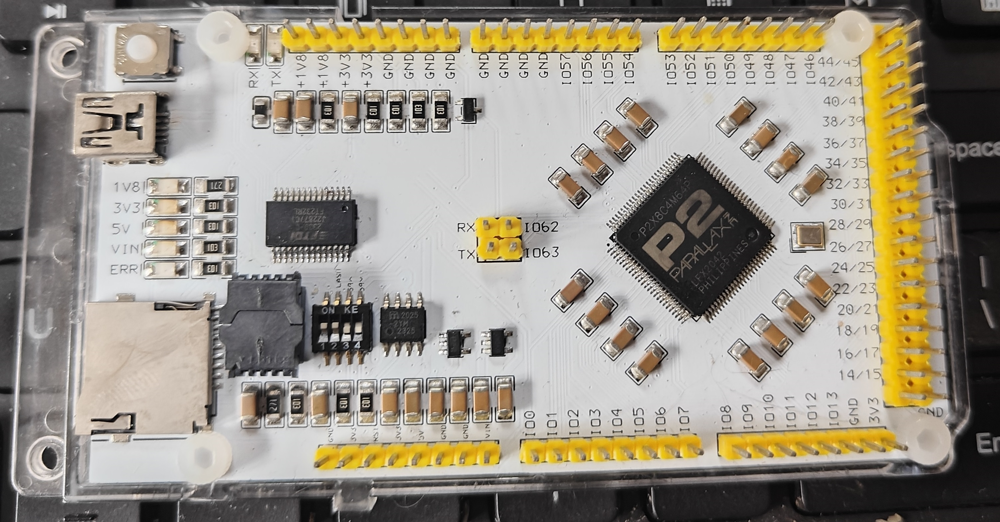
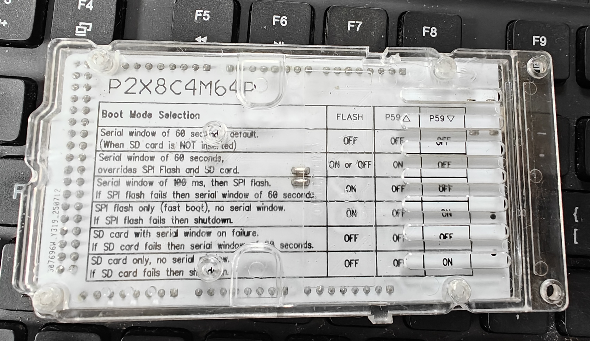

<!--
 * @Author: 无序熵增
 * @Date: 2025-11-04 09:47:54
 * @LastEditors: 无序熵增
 * @LastEditTime: 2025-12-18 22:10:54
 * @Description: 
 * 
 * Copyright (c) 2025 by 无序熵增, All Rights Reserved. 
-->

🌍 **Language** / **语言选择**
  

# P2DUINO —— Arduino 外形的 P2X8C4M64P 开发板
 <!-- 板子正面图片 -->

## 什么是 P2X8C4M64P
Propeller P2X8C4M64P（简称 P2）是一款具备 MPU 级性能的多核微控制器，在实时模拟与数字应用方面表现尤为出色。  
P2 旨在帮助工程师实现最快的产品上市周期，其高度灵活、确定性的硬件架构和开发环境，避免了传统 FPGA 类开发流程中常见的复杂性、高成本以及较长的交付周期。

## 主要特性
- **Arduino 外形兼容**：可直接使用 Arduino 扩展板
- **引脚资源**：58 个 Smart Pin
- **8 核心**：高性能并行处理
- **SD**：支持 SD 卡
- **SPI Flash**：支持在 SPI Flash 与 SD 卡之间切换启动
- **易于生产**：单面贴装设计，使用 1206 封装电阻与电容
- **易于使用**：板上标注清晰，具备短路保护、电源指示灯及掉电指示灯
- **背面说明**：使用说明印在背面，可根据说明切换拨码以更改启动方式

 <!-- 板子背面图片 -->

## Propeller 2 P2X8C4M64P 技术规格

### 八个完全相同的 32 位处理器（Cog）：
- 可访问所有 I/O 引脚，并提供 4 路高速 DAC 输出与 4 路高速 ADC 输入
- 每个 Cog 拥有 512 long 的双端口寄存器 RAM，用于代码和高速变量
- 512 long 的双端口查找 RAM，用于代码、数据流查找和变量
- 支持直接从寄存器 RAM、查找 RAM 以及 Hub RAM 执行代码
- 约 358 条用于数学、逻辑、定时与控制的独特指令
- 所有数学和逻辑指令均为 2 个时钟周期执行（包括 16×16 乘法）
- 6 时钟周期的自定义字节码解释器，支持解释型语言
- 可将 Hub RAM / 查找 RAM 数据流输出至 DAC、引脚或 HDMI 调制器
- 可将引脚或 ADC 数据流写入 Hub RAM
- 支持使用 3×3 矩阵（8 位有符号/无符号系数）的实时色彩空间转换
- 支持 8:8:8:8 数据格式的像素混合指令
- 16 个独立事件追踪器，可轮询或等待
- 3 个可配置优先级的中断
- 隐藏调试中断，用于单步执行、断点与调试轮询

### 为各处理器服务的中央 Hub：
- 512 KB 连续 RAM，20 位地址空间
- 所有 Cog 可同时以每时钟 32 位进行顺序读写
- 支持按字节、字、long 访问，小端格式
- 最后 16 KB RAM 可设置为写保护

### 32 位流水线 CORDIC 运算单元（带比例因子修正）：
- 32 × 32 位无符号乘法，64 位结果
- 64 / 32 位无符号除法，得到 32 位商和 32 位余数
- 64 → 32 位平方根
- (X32, Y32) 按 Theta32 旋转
- 极坐标 (Rho32, Theta32) → 笛卡尔坐标 (X32, Y32)
- 笛卡尔坐标 → 极坐标
- 32 → 5.27 无符号对数
- 5.27 → 32 对数转无符号
- 各 Cog 每 8 个时钟可启动一次 CORDIC 运算，55 个时钟后获得结果
- 16 位信号量，支持原子级读-改-写
- 64 位自由运行计数器，每个时钟递增，复位时清零
- 高质量伪随机数发生器（Xoroshiro128**），上电时以真随机数种子初始化，每时钟更新，并为每个 Cog 与引脚提供独立数据
- 支持 Cog 的启动、轮询与停止机制

### 16 KB 启动 ROM：
- 启动时加载至 Hub RAM 的最后 16 KB
- SPI 启动加载器，支持 8 引脚 Flash 或 SD 卡自动启动
- 串口加载器，支持主机启动
- 支持 Hex 与 Base64 下载协议
- 终端监视器：输入 `> ` 后按 CTRL+D 进入
- TAQOZ Forth：输入 `> ` 后按 ESC 进入

### 64 个 Smart I/O 引脚：
- 64 个完全相同的 Smart I/O 引脚，每 4 个为一组独立供电
- 8 位 DAC（120Ω / 1kΩ），支持 16 位过采样、噪声及数字模式
- Δ-Σ ADC，5 个量程、2 个信号源，支持 VIO/GIO 校准
- 多种 ADC 采样模式：自动 2ⁿ SINC2、可调 SINC2 / SINC3、示波模式
- 逻辑、施密特触发、引脚比较器及 8 位电平比较输入
- 2/3/5/8 位一致性输入滤波，可调采样率
- 可融合相邻 -3 至 +3 引脚的输入
- 支持正/负本地反馈，可选择是否使用时钟
- 高、低电平输出可独立配置驱动模式：
  logic / 1.5k / 15k / 150k / 1mA / 100µA / 10µA / 平坦模式
- 可编程 32 位时钟输出、边沿输出、NCO / 占空比输出
- 三角波 / 锯齿波 / SMPS PWM 输出，16 位帧 + 16 位预分频
- 正交解码，32 位计数器，支持位置与速度模式
- 16 种单/双信号 32 位测量模式
- USB 全速与低速（通过奇偶引脚对）
- 同步串行通信，1–32 位，最高至时钟频率的一半
- 异步串行通信，1–32 位，最高至时钟频率的三分之一

### 时钟模式：
- 6 种时钟模式，全部由软件控制，支持无毛刺切换
- 内部 20MHz+ RC 振荡器（典型 25MHz），默认启动时钟
- 晶振振荡器，内置 7.5pF / 15pF 负载电容，可驱动 PLL
- 外部时钟输入，可驱动 PLL
- 分数 PLL：1..64 分频 → 1..1024 倍频 → 可选 (1..15)×2 后分频
- 内部 ~20kHz RC 低功耗振荡器（约 130µA）
- 时钟可完全停止以实现最低功耗（约 100µA，主要为漏电）

